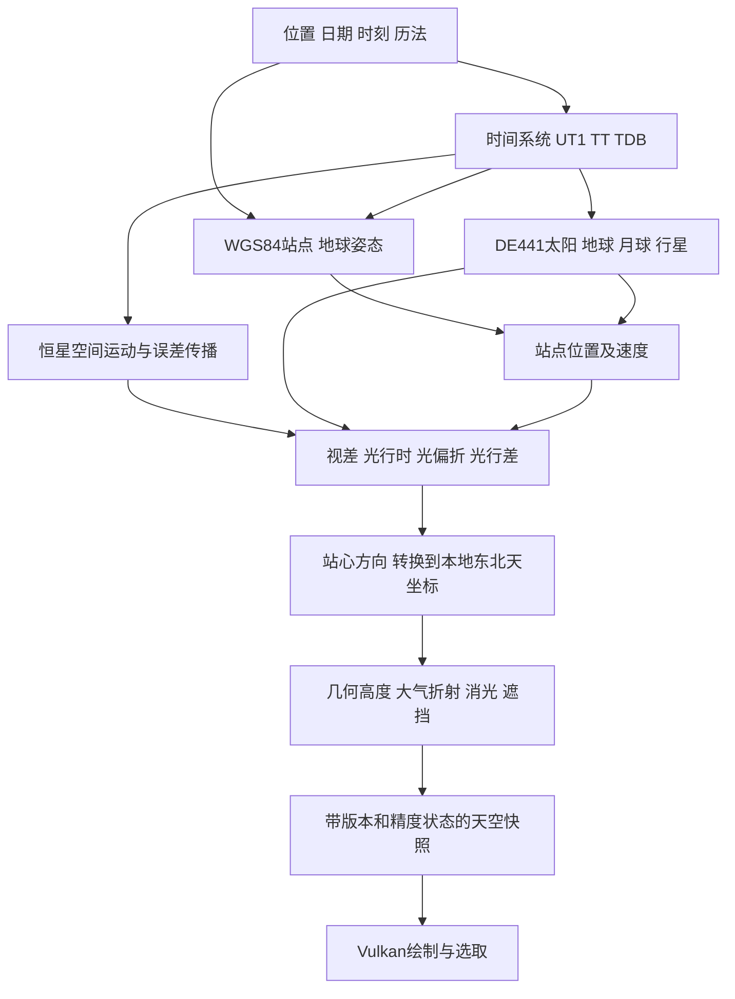
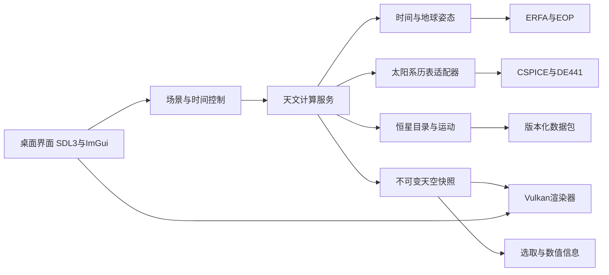

# 万年星空模拟器设计

版本：0.1 · 调研日期：2026-09-04。用户已授权实现；本文保留原始设计目标，实际完成范围、测试与差异见 [实现记录](IMPLEMENTATION.md)。

目标是在桌面上输入地球位置、日期和时刻，看到对应的恒星、太阳、月球和行星，并能连续播放时间变化。采用 **C++20 + SDL3 + Vulkan**；macOS 使用 MoltenVK，Windows、Linux 使用原生 Vulkan 驱动。天体计算与渲染分离，安装数据包后离线运行。

用户已确认时间范围为“以公元2000年为中心，前后各5000年”。一万年的天空可以计算，但不同年代、不同天体的可信程度不同。本产品会同时记录结果、使用的模型和不确定性，不把远古或未来的外推值显示成观测事实。

设计阶段交付了本文、数据调研和 Vulkan 环境。后续按用户“实现吧，开始”的指令开发；Windows 和 Linux 按要求暂不测试。

## 1. 产品范围与约定

### 1.1 日期、位置与视角

| 项目 | 约定 |
| --- | --- |
| 时间域 | 采用天文年号和向前延伸的公历，`[-3000-01-01 00:00:00, +7000-01-01 00:00:00)`，共10000个日历年；7000年1月1日是排他上界 |
| 公元前显示 | 天文年0 = 公元前1年，天文年−3000 = 公元前3001年；界面同时显示传统纪年，避免差一年 |
| J2000 | 星表/历表的参考历元单独表示，不把上述日历边界误当成 J2000 ±5000个儒略年 |
| 时刻 | 支持小时、分钟、秒；仅输入日期时，显式采用当地平太阳时22:00，随后可拖动一天内的时间 |
| 地点 | WGS84 大地纬度 `[-90°,90°]`、东经为正的经度、椭球高；支持坐标直接输入及收藏地点 |
| 地面约定 | 输入点固定在现代参考椭球上；不推演万年板块移动、古海岸线或古地形 |
| 视角 | 从站点观察天空；支持水平视角、全天鱼眼、赤道坐标网；首版最小视场1°，最大鱼眼视场180° |
| 天空模式 | 默认模拟昼夜、大气和地平遮挡；另有关闭大气的星图模式，白天也能研究天体位置 |

内部不依赖操作系统日期控件或 Unix 时间戳表示整个时间域。公历/儒略历是显示和输入规则，UTC/UT1/TT/TDB 是时间尺度，两者分别选择。默认不自动套用1582年的地方历法切换；可显式选择儒略历，保存时写明历法。

“任意地点”指可输入任意有效经纬度，而不是首版必须内置联网地图。极点处用用户经线定义参考北向，天顶处方位角标为未定义，不能产生 NaN 或视角抖动。

### 1.2 必须包含的天体与功能

- 恒星：亮星完整性优先，主数据包组合 Hipparcos-2、Gaia DR3 和经核验的亮星补充；按观测模式和星等筛选显示。
- 太阳系：太阳、月球、水星、金星、火星、木星、土星、天王星、海王星。地球作为观察者和遮挡地面，不在地面天空中画出地球圆盘。冥王星列为可选目标。
- 每个可见目标可点选，显示名称、方位/高度、赤经/赤纬及所属坐标系、星等或亮度估计、距离、数据来源、外推状态。
- 暂停、正反向播放、单步、任意日期跳转、地点收藏、场景保存、截图；截图附带计算配置及数据版本。
- 白昼、晨昏、月相、地平线、基础大气消光与折射；地平线以下默认隐藏。

首版不承诺真实天气、光污染历史、恒星演化/超新星发生日期、任意双星的万年轨道、行星地表纹理的万年准确朝向，也不承诺精密日月食接触时刻。人造卫星、小行星、彗星、全量深空天体、移动端和网页端另列扩展；它们不是本次必要实现范围。

## 2. 关键设计决定

| 决定 | 选择与原因 |
| --- | --- |
| 全时段太阳系历表 | 固定使用 JPL DE441，覆盖整个目标区间；不把短期历表超范围外推 |
| 恒星 | 保留原始历元、单位、运动参数和质量信息，计算恒星自身运动；不把今天的星图当作固定天空 |
| 数值精度 | CPU 天文计算使用 double、分段儒略日；GPU 使用观察者附近的方向与局部坐标 float，不依赖 shaderFloat64 |
| 天文基础库 | ERFA 处理时间尺度、标准天文变换和空间运动；CSPICE 读取 SPK。两者都封装在可替换接口后 |
| 地球姿态 | 现代使用 IAU 2006/2000A 与 EOP；长时期使用 Vondrák 长期岁差，章动与地球自转采用显式近似策略 |
| 渲染 | 原生 Vulkan，基础能力以 Vulkan 1.2 为设计下限；优先实例化星点和标准 graphics/compute pipeline |
| 窗口和输入 | SDL3 创建窗口及 Vulkan surface；不以 SDL GPU 抽象替代用户要求的 Vulkan API |
| UI | Dear ImGui 的 Vulkan/SDL3 后端，中文字体随应用打包，先满足桌面交互与可读性 |
| 运行方式 | 数据包本地读取，联网用于获取/更新数据，不逐帧请求第三方服务 |
| 版本策略 | 正式实现时锁定依赖版本/提交、数据校验和；已有场景不会因后台更新悄悄改变结果 |

SDL3 官方提供 Vulkan instance 扩展查询、入口点和 surface 创建接口。[SDL3 Vulkan 文档](https://wiki.libsdl.org/SDL3/CategoryVulkan)

## 3. 数据方案

### 3.1 已收集与待收集

| 数据 | 当前结果 | 用途 |
| --- | --- | --- |
| Hipparcos-2，CDS I/311 | 已下载全表，117,955条，压缩8,977,907字节；已核验 gzip、记录数及 HIP 唯一性 | 亮星天体测量基础与 Gaia 亮端补充 |
| Bright Star Catalogue 第5版预备版，CDS V/50 | 已下载全主表，9,110条目录记录，其中官方说明9,096颗恒星；压缩573,921字节 | HR/HD标识、V星等、颜色、光谱及径向速度辅助 |
| Gaia DR3 | 已从 ESA TAP 下载200条 `G<6` 的字段样本；不是全天完整星表 | 检查模式、缺失值；正式包按星等/分区提取 |
| JPL DE441 | 已下载技术说明及 SPK 覆盖摘要；两个大型 BSP 文件尚未下载 | 全时段太阳系状态 |
| EOP、闰秒表 | 已确认官方来源；实现阶段固定一份快照并保留版本 | 现代日期地球姿态和 UTC 转换 |

文件、原始链接、查询和散列见 [数据来源与采集记录](DATA_SOURCES.md)；实际原始数据在 `docs/research/`。大体量 DE441/Gaia 下载是实现阶段的数据构建工作，本阶段不把“已确定下载源”写成“已获得全部数据”。

### 3.2 行星历表：DE441

NAIF 官方目录提供 `de441_part-1.bsp` 与 `de441_part-2.bsp`，各约1.5 GB级，合计约3 GB级。两段在1969年有重叠，精确覆盖以文件中 SPK segment 的 ET/JD 边界为准；不凭文件名或公元前年份字符串推断。JPL 技术说明给出的总体年代约为天文年−13200至+17191，足够覆盖本项目。[JPL DE441 技术说明](https://naif.jpl.nasa.gov/pub/naif/generic_kernels/spk/planets/de441_tech-comments.txt)、[NAIF 文件目录](https://naif.jpl.nasa.gov/pub/naif/generic_kernels/spk/planets/)

选型规则：

1. 原型直接读取官方完整 SPK，计算仅访问当前需要的记录，不将数GB数据整体读入内存。
2. 分发版可用 NAIF 工具裁剪成目标时段的子集，保留全部所需中心链和边界外至少2天的光行时余量；不得降低 Chebyshev 阶数或自行重新拟合后仍冒称原始 DE441。
3. 裁剪前后按 body、时间点对照，并保存原始版本、裁剪工具、参数、段摘要与散列。
4. 全程默认同一 DE441 解，避免播放中自动在不同 DE 版本之间切换而跳动。较新的 DE442 存在，但其通用文件覆盖约1550—2650年，不能替代本项目长期主表。
5. 数据不足时报缺少的数据包，不静默切成低阶开普勒轨道。

DE441 中包含太阳、地球、月球等，外行星主要提供**行星系统质心**。水星/金星中心、地球中心和月球有直接的中心链；火星至海王星的物理中心不是通用 DE441 文件的全部内容。首版远年代采用对应系统质心作为视位置近似，并在模型元数据标记；需要更精密中心位置的现代模式可加卫星 SPK，但仅在其实际覆盖期启用。不能把 `EARTH BARYCENTER (3)` 当成地球中心 `EARTH (399)`。[NAIF SPK 内容摘要](https://naif.jpl.nasa.gov/pub/naif/generic_kernels/spk/planets/aa_summaries.txt)

DE441 的长时间覆盖不表示整个区间都具有当代观测精度；其月球动力学处理也不同于 DE440。设计不承诺万年范围的厘米级轨道或亚角秒真实天空。[JPL DE440/DE441 论文入口](https://ssd.jpl.nasa.gov/doc/de440_de441.html)

### 3.3 恒星主表与合并

Gaia DR3 提供大规模位置、视差、自行、光度和部分径向速度；其亮端与解的完整性存在限制，因此需要亮星补表。[ESA DR3 内容](https://www.cosmos.esa.int/web/gaia/dr3)

首版数据构建采用 Gaia DR3 `G≤12` 候选集 + Hipparcos-2 全表 + 亮星补充。这个阈值是初始包的工程选择，不等于一万年内所有肉眼可见恒星的严格完备边界。已知近邻/高自行恒星应扩展候选集；以后加入更深星等包。对“今天较暗、未来因接近而变亮”的遗漏，明确记录选择函数，不能声称穷尽所有恒星。

合并流程：

1. 保留原始行及 catalogue/release/source_id，建立内部稳定对象ID与多个来源ID。
2. 优先采用官方交叉匹配结果，核对多对一、双星分量和不可靠匹配。备用位置匹配必须先将两份星表传播到同一历元，并考虑误差及运动。
3. 高质量单星优先 Gaia；Gaia 缺测或亮端解不佳时用 Hipparcos-2；双星、光心解、高 RUWE、异常速度进入专门质量分支，不能仅按“新版本”覆盖。
4. BSC 的 FK5/J2000 坐标不直接冒充 ICRS；BSC 径向速度为辅助值，保留其日心、变量/双星标记及未知误差，不能提升成 Gaia 等级。
5. 同一物理星/双星分量只渲染一次；无法确定分量映射时保留未合并状态供检查。
6. 不要求恒星具有径向速度才进入星图，否则会丢失大量亮星；参数不全采用明确的降级传播。

Gaia 样本已经显示：200条记录中51条没有径向速度、20条没有视差。Hipparcos-2 全表有4,013条非正视差。这些是本次文件检查结果，不能把该 Gaia 样本比例推广到全天。

每条标准化恒星记录至少包含：来源标识、参考历元及时间尺度、ICRS方向、自行两分量、视差、径向速度、光度波段/颜色、误差协方差、质量与分量标记。未知值必须是 null/有效位，不以0冒充实测值。Gaia `pmra` 是 `dα/dt·cosδ`，`ref_epoch` 是 TCB 儒略年；适配器负责单位和时间尺度转换，不能与普通RA导数、TT历元混用。[Gaia DR3 数据模型](https://gea.esac.esa.int/archive/documentation/GDR3/Gaia_archive/chap_datamodel/sec_dm_main_source_catalogue/ssec_dm_gaia_source.html)

### 3.4 数据包与许可

正式运行包分为元数据、恒星分区、太阳系 SPK、EOP/时间数据、显示资源五部分。所有包包含来源、版本、许可/署名、生成参数、字节数、SHA-256、坐标/时间定义、覆盖期及已知缺陷。

下载采用 `.partial`、可恢复下载、散列验证后原子切换；异常文件不能替换已可用版本。禁止把整个 Gaia 主表当成首版默认下载；下载界面展示大小、覆盖和状态。

Gaia 要求署名 ESA/Gaia/DPAC，并提供相应论文引用。ESA 的 Hipparcos/Tycho 页面列有 CC BY-NC 3.0 IGO 条款，因此本次用于本地调研；若未来要商业分发含这类数据的包，需确认具体产品许可或更换相应补表，不能把“可下载”当作任意再分发许可。BSC 也保留其原始说明，分发条款在数据构建阶段核实。[Gaia 使用说明](https://gea.esac.esa.int/archive/documentation/GDR3/Miscellaneous/sec_credit_and_citation_instructions/)、[ESA Hipparcos 目录与条款](https://www.cosmos.esa.int/web/hipparcos/catalogues)

## 4. 天文计算

### 4.1 总流程

图中本地坐标采用 ENU：东 East、北 North、天 Up；三轴约定在接口与测试中固定。

### 4.2 时间系统

时间结构使用二段儒略日，类型区分 UT1、TT、TDB、TCB 和现代 UTC。历表查询使用 TDB，自转角使用 UT1，现代岁差章动使用 TT；Gaia 传播保留其 TCB 参考定义。

- 现代 UTC：在闰秒表支持区间内通过 UTC→TAI→TT，EOP 给出 UT1−UTC；支持合法的23:59:60。
- 历史/远未来：默认输入 UT1 或当地平太阳时，`TT = UT1 + ΔT`。不把1972年前的日期或未知闰秒的未来标为真实 UTC。
- 时区：在实际时区数据支持范围内处理本地民用时间、夏令时重叠/缺失；其他年代用显式 UT1 或固定时差约定。当地平太阳时为 `UT1 + 东经/15°` 小时，不等于日晷真太阳时。
- 用户可锁定 TT/TDB 进行天文对比，也可锁定 UT1 查看某地某时刻。配置中记录锁定的是哪一种，避免不确定性分析错用时间。
- ΔT：有观测数据的年代优先观测快照；长年代使用版本固定的历史拟合/长期近似，允许用户覆盖。NASA 多项式在更远年代属于外推，不能贴上“实测”标签。
- TT↔TDB：现代使用 ERFA 的标准近似；长时期单独标记模型外推，在验收中对比另一套转换/TT≈TDB基线，列出对月球方向的贡献；不把1950—2050年的纳秒级说明外推到一万年。不能用 UTC 解析器绕过这个问题。

ΔT 的定义和观测来源见 [USNO ΔT](https://maia.usno.navy.mil/products/deltaT)、[NASA 长期近似](https://eclipse.gsfc.nasa.gov/SEcat5/deltatpoly.html)；TT/TDB 近似的有效性见 [ERFA dtdb](https://raw.githubusercontent.com/liberfa/erfa/master/src/dtdb.c)。

### 4.3 地球姿态与站点

现代分支使用 IAU 2006岁差、IAU 2000A章动、ERA及 EOP 极移/天极改正，以 ERFA/SOFA 的标准结果为基准。ERFA 的高层便利函数可能内置近现代近似地球历表；本项目通过底层接口传入 DE441 地球位置与速度，避免调用受限历表后仍声称覆盖一万年。

长时期分支采用 Vondrák 2011/2012 长期岁差（含勘误，ERFA `ltp/ltpb`），避免直接将 IAU 2006的近历元多项式外推5000年。该模型解决长期岁差，不自动解决章动、恒星时和地球自转未知量。[ERFA 长期岁差实现与参考](https://raw.githubusercontent.com/liberfa/erfa/master/src/ltp.c)

**长期姿态具体策略：**

1. 用长期模型构造带正确框架偏置的平均天极；以 IAU 2000A 章动项外推作为首版可见天空的近似修正，单独标为 `nutation_extrapolated`，并保留“平均天极”对照模式。它不是长期高精度章动解。
2. 从同一条天极轨迹构造非旋转原点，以 J2000 的标准原点定向为锚点，按 IERS 的非旋转原点定义数值积分/平行运输。离线生成可检验的系数或采样缓存，运行时插值。与同一 ERA 配合，保持框架一致。
3. 不直接把 `ltpb` 的岁差矩阵与 ERA相乘，也不把长期天极塞入仅与IAU2006/2000A配套的 `s06` 多项式后当作长期解。平均春分点、真春分点、CIO必须区分。
4. 1900—2100年采用标准现代分支，1850—1900和2100—2150年为工程过渡带：对去除地球自转后的姿态做平滑球面插值，再施加同一 ERA。过渡区明确标记混合模型；该区间是产品边界，不是 IAU 发布的适用性声明。
5. EOP 覆盖外，极移和天极实测改正采用0的名义值，标为未知近似；不会把0写成观测结果。
6. 第一开发里程碑必须完成整条长期姿态链的独立数值对照与过渡连续性验证；未通过不能发布“万年当地天空已完成”。

相关标准见 [SOFA 地球姿态资料](https://www.iausofa.org/2023-10-11c)、[IERS Conventions 第5章](https://iers-conventions.obspm.fr/content/chapter5/icc5.pdf)。这部分自研范围仅为长期模型的组合、原点一致性和缓存；不会重新发明现代岁差章动系数。

站点用 WGS84 椭球转换为 ITRS 位置；地球姿态将其转换到天球框架，计算自转速度并结合 DE441 的地球质心状态。近代高精度路径保留相对论框架转换；地面潮汐、站点板块运动等未建模项纳入误差说明。平地默认地平线，观察高度带来的地平下沉可计算；山体和城市遮挡是可导入的地平线轮廓，不推断历史地形。

### 4.4 恒星运动与观测方向

有可靠距离和径向速度的恒星采用三维空间运动模型。概念上 `r(t)=r0+v·Δt`，再求对应观察时刻的方向；实际采用经验证的空间运动/光行时处理，避免直接用 `α+=pmra·t` 或重复计算恒星光行时。`pmsafe/starpm` 作为现代与长期线性模型的对照，所有返回的距离调整、超速、未收敛状态必须保留。[ERFA starpm](https://raw.githubusercontent.com/liberfa/erfa/master/src/starpm.c)、[ERFA pmsafe](https://raw.githubusercontent.com/liberfa/erfa/master/src/pmsafe.c)

降级规则：

| 数据情况 | 行为 |
| --- | --- |
| 完整且可信的位置/自行/距离/径向速度 | 传播三维状态，包含透视加速度；传播协方差 |
| 缺径向速度 | 使用0作为明确的名义假设；显示径向速度未知，可做用户指定速度范围的敏感性分析 |
| 非正视差或低信噪比 | 不用 `1/parallax` 得到负距离或极端速度；保留切平面角运动模型，距离未知 |
| 缺自行 | 保留原历元方向，标为固定方向近似；跨世纪结果不能显示为可靠外推 |
| 双星、加速解、可变光心 | 有可信轨道且处于其有效区间才用轨道；否则以系统/光心近似并提高不确定性 |

标准星表位置本身已有光行时相关的观测定义。适配层需要选定“光学天体测量状态”还是“运动学状态”，由同一函数管理相互转换；不能先使用已含光行时的传播函数，再按距离/c回退一次。

误差采用协方差经雅可比传播；选中对象或高风险对象可进行 Monte Carlo。缺少径向速度/双星轨道产生的是模型缺项，不能伪装成已知高斯误差。单纯的尺度示例：自行误差1 mas/年累积5000年贡献约5角秒，还未包含径向速度、双星和银河引力的影响。

首版匀速模型忽略银河势及复杂伴星扰动；高精度星际遭遇计算不在本次目标内。恒星亮度以目录平均光度为基准，可依据可信距离变化调整；未知内禀光变、演化和消光随位置的变化不做确定性预测。

### 4.5 太阳系视位置

太阳系采用“接收时刻的站点 + 发射时刻的目标”模型：

1. 读取 DE441 中以太阳系质心为基准的地球、目标状态；站点位置和速度采用接收时刻。
2. 迭代求光行时，使发射时刻与站心距离/c自洽；每次确认查询时刻仍在 kernel覆盖内。
3. 计算站心视差，应用所选的引力光偏折和观察者光行差；明确定义精度模式。CPU统一完成这条链。
4. 变换到观测日期的天球框架，再到本地ENU方向。

CSPICE 第一版只负责几何状态查询（`NONE`）。光行时、光偏折和光行差在观察模型集中应用；不用一边请求 `CN+S` 一边又交给 ERFA 再校正一次。CSPICE 的修正模式含义可用作对照。[SPICE 观测状态文档](https://naif.jpl.nasa.gov/pub/naif/toolkit_docs/C/cspice/spkcpo_c.html)

太阳和月球使用真实角半径的圆盘；行星根据角直径在星点与圆盘之间过渡。月相和行星相位根据照明方向计算，遮挡按距离而不是绘制顺序猜测。精密月球天平动、环面姿态和行星纹理朝向需要额外 PCK/姿态模型，它们的有效期单独管理；远年代没有可靠姿态数据时使用简化圆盘。

### 4.6 大气与可见性

几何方向先完成，最后应用折射。几何高度和折射后高度同时保留，太阳/月球边缘与地平遮挡采用一致策略。近地平折射高度依赖气压、温度等，不能保证角秒级；低于模型有效高度时平滑限制并标记，不能让公式奇点拉出光带。

视觉模型包含 Rayleigh/Mie散射近似、太阳高度驱动的昼夜背景、月光增亮、消光、可配置背景亮度和暗适应。太阳落山不立即跳成纯黑；星等阈值由显示模式控制。首版不连接天气服务，因此展示的是用户选择的大气条件。

银河背景若使用现代全天纹理，必须标为示意背景；远年代星图中默认可关闭。恒星运动改变星座形状，星座连线跟随成员星移动，但文化图案与现代星座边界本身不是古代天文学的重建。

## 5. 精度如何表达

产品区分三个概念：**相同模型的计算误差、天体数据的不确定性、与真实历史/未来天空的偏差**。下列数字是待验收目标，不是本次已测得的模拟器性能。

| 层次 | 目标或限制 |
| --- | --- |
| SPK读取/插值 | 与独立CSPICE参考在同kernel、同TDB、同中心下，位置差目标≤1米；不代表DE441对真实轨道的误差≤1米 |
| 现代几何/视方向 | 在1900—2100年、模型参数严格一致且远离太阳边缘时，与参考实现方向差目标≤0.1角秒；地球姿态EOP覆盖不足则单独比较名义模型 |
| 月球站心方向 | 现代相同模型差目标≤0.5角秒；单独校验月球视差与光行时 |
| 长时期姿态 | 与选定长期参考模型的方向差目标≤60角秒，数值积分/插值自身贡献≤0.05角秒；不等同于历史地平坐标误差上限 |
| 完整恒星空间运动 | 在相同输入和匀速模型下与参考一致；每星另报形式误差和缺项，无全星表统一的万年误差承诺 |
| GPU投影 | 相对CPU投影≤0.1像素，覆盖1°—180°视场；更窄视场另做精度方案 |
| 低空折射与可见性 | 视为气象条件下的近似，不进入亚角秒承诺 |

例如，固定TT时若ΔT不确定100秒，地球转角的不确定量级约为1500角秒，即0.42°；对具体恒星的方位/高度投影影响随地点和方向不同。若用户锁定的是UT1，地球转角已由输入确定，ΔT主要改变对应TT与行星/月球轨道位置，不能直接套用这条转角例子。[USNO 时间与角度换算](https://maia.usno.navy.mil/information/eo-values)

结果结构的质量状态至少包含：`observed_inputs`、`modelled`、`extrapolated`、`missing_radial_velocity`、`distance_unknown`、`barycenter_proxy`、`orientation_approximate`。界面用“观测数据支持 / 模型推算 / 长期外推”及简短原因展示，不把内部枚举名直接暴露给普通用户。

远年代ΔT无法可信估计统计误差时，显示“误差范围未知”，允许用户扫描不同ΔT情景；不凭经验随意给出一个看似正式的±数值。

## 6. 软件架构

### 6.1 模块边界

| 模块 | 负责内容 | 输出约定 |
| --- | --- | --- |
| `time` | 历法、时间尺度、时区、ΔT、闰秒 | 带尺度类型的二段JD、转换质量 |
| `observer` | 地理点、姿态、站点状态、地平线 | 位置/速度及明确坐标框架 |
| `ephemeris` | kernel清单、覆盖、几何状态查询 | body/center/frame/epoch明确的double状态 |
| `catalog` | 星表读取、别名、交叉匹配、空间索引 | 原始及标准化星表记录 |
| `astrometry` | 恒星传播、观测效应、误差传播 | 几何与视方向、质量状态 |
| `sky` | 快照构建、可见性、亮度、标签候选 | 与某一场景版本完全对应的数据 |
| `render` | Vulkan资源、绘制、后处理、读回 | 帧图像与GPU统计 |
| `app` | 输入、播放、面板、场景文件、截图 | 用户行为与持久化配置 |
| 数据构建工具 | 下载、规范化、去重、分区、校验 | 可复现的数据包与构建报告 |

天文核心不链接 Vulkan/SDL，可用无窗口命令行输出数值用于验收。渲染器不解析星表历元、不计算ΔT。所有角度在内部用弧度，长度/速度跨接口写明单位，SPICE的km/km·s⁻¹在边界转换。

### 6.2 关键数据契约

这些是设计约定，尚未生成代码：

- `Scenario`：地点、历法、用户输入时间、锁定时间尺度、视角、大气、地平线、显示选项、数据包版本。
- `TimeContext`：TT/TDB/UT1及可选UTC、ΔT/EOP来源、转换模型、有效期和外推标记。
- `BodyState`：目标ID、中心ID、坐标系、时间尺度与历元、位置、速度；不得返回不带中心语义的裸向量。
- `CatalogStar`：稳定ID与来源ID、参考历元、参数、完整性位、误差/协方差、光度波段和质量标记。
- `ObservedObject`：ICRS相关方向、站心几何方向、折射后方向、距离、角半径、相位、亮度及质量信息。
- `SkySnapshot`：场景世代号、计算时间、数据版本、对象数据、标签候选、可选误差；生成后不可变。

场景文件使用带schema版本的JSON；天体ID用字符串或明确64位整数，不能经过JS浮点而损失Gaia编号。内部GPU绘制索引使用32位局部ID并映射回天体ID。

### 6.3 线程与更新

主线程处理窗口与输入；计算线程生成天空快照；渲染提交由固定线程管理；下载和文件I/O独立。CSPICE调用集中到单个服务线程并串行化，不假设其全局kernel/error状态可以被多个线程同时使用。[NAIF Toolkit 已知问题与限制](https://naif.jpl.nasa.gov/pub/naif/toolkit_docs/C/req/problems.html)

每次修改时间/地点递增世代号。耗时计算结束时若结果过期则丢弃，不把旧时间的星图贴上新时间标签。拖动期间可以暂显上一份完整快照，并在时间条标明正在计算；停止拖动后自动收敛到最新场景。

正常播放时，行星/地球状态和姿态按误差预算自适应缓存/插值；每段插值必须通过中点或额外采样检查。快速跨年时直接查询新时刻，不从上次状态逐帧积分。精确选取和截图强制完成当前时刻计算。

恒星三维空间运动按慢变量历元批次更新；年周/周日效应单独更新。高自行、近距离和低空目标不能使用过粗缓存。快照生成可并行处理恒星分区，但只使用已获取的历表/观察上下文，不从每个工作线程调用CSPICE。

### 6.4 分区、加载与移动恒星

首版 Hipparcos 规模可常驻内存；Gaia包按等面积天区及星等分层加载，构建端采用经过校验的HEALPix实现，运行时读取稳定的分区索引。

**索引按原始历元分区，恒星会跨区移动。** 查询必须使用覆盖目标时刻运动位移的保守包围范围，或用分时段构建的索引；高自行星使用全局独立列表。不能只查询摄像机当前所在的J2016天区再传播，否则会漏掉从别处移入视野的恒星。径向速度/距离未知导致运动包围范围很大时，宁可多取候选。

视锥裁剪后仍保留边缘余量，防止自行、视差、折射和星点光晕在边缘闪烁。只有计算最终方向后才能做精确视锥与地平线判定。小规模数据集与完全不裁剪的CPU实现逐对象比对，要求无漏星。

## 7. Vulkan渲染设计

### 7.1 能力基线

运行时查询Vulkan版本、队列、presentation、surface格式、采样/混合格式、描述符和缓冲区限制。设计下限Vulkan1.2；使用传统render pass与明确barrier即可完成首版。新版dynamic rendering、timeline semaphore、descriptor indexing等只有在检测与测试后作为优化启用，不成为低端设备隐性依赖。

macOS创建实例时启用 `VK_KHR_portability_enumeration` 及 `VK_INSTANCE_CREATE_ENUMERATE_PORTABILITY_BIT_KHR`；设备报告 `VK_KHR_portability_subset` 时必须启用它，并遵循其特性限制。SDL返回平台surface扩展。MoltenVK负责SPIR-V到MSL转换，项目统一编写GLSL并离线编译SPIR-V。[MoltenVK 官方说明](https://github.com/KhronosGroup/MoltenVK)

首版避免geometry shader、宽线、GPU双精度、强制bindless和厂商扩展。星点和线条均使用三角形/实例化四边形，降低各平台差异。MoltenVK是通过Metal实现的Vulkan子集，不能把安装的SDK版本当成所有特性均可用的保证。

### 7.2 一帧的绘制顺序

1. 为当前快照更新uniform与可见对象buffer。
2. 绘制天空背景/大气到线性HDR目标，优先验证RGBA16F的attachment与blend支持；不支持时采用明确的低动态范围回退。
3. 绘制可选银河示意背景，再绘制恒星实例。星点亮度近似按 `10^(-0.4m)`映射，颜色结合B−V/BP−RP并校准不同波段；缺颜色时使用中性色。
4. 绘制太阳/月球/可分辨行星圆盘及环的简化几何；按角半径、距离处理遮挡与相位，近月/近行星恒星不能穿透圆盘。
5. 应用地平遮罩；可选地景与轮廓，均采用与天空一致的方位/高度约定。
6. 可选受控bloom和曝光映射，然后绘制坐标线、标签和UI。

星点PSF的积分亮度需归一化，避免缩放/分辨率改变时能量失控。低亮度星点不因一个像素采样不足而突然消失；使用抗锯齿和合理的最小PSF。鱼眼投影以方向直接映射，不能拿透视矩阵硬拉到180°。

天文计算的角度/公里值不会以巨大world-space float送入GPU。CPU先转换为当前观察者的单位方向/相机局部坐标再量化；1°窄视场仍需和double投影对比。若未来要角秒级望远镜视场，再引入更高精度局部投影，不能默认当前方案足够。

### 7.3 资源与同步

- Vulkan内存通过VMA或等价的小型分配器封装；固定2帧在途，资源按fence完成后释放。
- 星点数据常驻GPU，动态数据用有界ring/staging buffer；避免每帧分配与重复上传完整星表。
- 分区卸载、resize、最小化、窗口跨屏和swapchain过期都走可重复进入的状态机；零尺寸窗口暂停绘制。
- pipeline与shader离线缓存以GPU/driver/shader版本区分；不复用不兼容缓存。
- 标签使用字体atlas和屏幕空间避让；中文字体支持动态补字或分块预热，防止一次烘焙全部字库造成长时间卡顿。
- 选取首版用CPU的屏幕空间索引与double方向复核，直接引用当前快照；数据规模需要时再增加GPU ID buffer。
- debug构建启用Khronos validation，测试时开启同步校验；不得用关闭验证层来掩盖资源生命周期错误。

### 7.4 性能目标

基准机为本次确认的Apple M4 Pro。目标是Release构建、1920×1080、基础视觉效果下稳定60 FPS（帧预算16.7ms）；4K目标至少30 FPS。所有数字需在实现阶段实测。

| 场景 | 初始预算 |
| --- | --- |
| 约12万颗基础目录，视锥内按模式显示 | 帧内CPU提交≤4ms，GPU≤10ms |
| 更深数据包 | 在可见候选≤100万、标签≤500的条件下测试，不承诺全量Gaia逐帧绘制 |
| 数据已缓存时任意日期跳转 | 基础包最新完整快照目标≤300ms |
| 冷启动 | 基础包目标≤3秒，不把首次联网下载算在启动时间里 |
| 内存 | 基础包总RAM目标≤512MB，GPU可配置上限256MB起；更深包使用LRU与显式上限 |

先使用CPU生成正确结果，再根据profile决定是否将部分批量校正/筛选搬到GPU。移动到GPU的计算仍须满足同一误差和漏星测试；不为了60FPS降低模型后不通知用户。

## 8. 交互布局与行为

主视图是一整块天空。底部时间条显示当前纪年、日期、时刻与时间尺度，提供暂停、反向、速度和步进。左侧地点/时间面板包含经纬度、海拔、时间输入和常用地点；右侧是可折叠天体信息。显示设置包含大气、地平线、星等、坐标网和标签。

首次运行使用可见的示例坐标与当前时刻，不擅自读取定位信息。用户改日期后保留地点和观察方向；点击天体可锁定目标跟踪，锁定模式明确展示。播放速度从秒到年每秒可选，负值表示倒放；速度以模拟时长定义，不以实际帧率累加浮点日数。

需要显式处理的状态：

| 状态 | 界面行为 |
| --- | --- |
| 只选日期 | 显示已采用的当地平太阳时22:00，时间可直接修改 |
| 选中历史/未来年份 | 使用合适的UT1/平太阳时输入，显示“长期外推”及主要缺项 |
| 新场景仍在计算 | 保留上一张完整图及其实际时间，显示目标时间正在计算 |
| 内核/星表缺失 | 显示缺失包、大小与覆盖范围，允许恢复下载；不画出假天体位置 |
| 天体在地平线下 | 信息仍可查询，标记不可见；是否透视地平线由用户选择 |
| 白天看不到星星 | 保留自然亮度，提供清晰的星图模式开关 |
| 非法日期/重复民用时刻 | 日期立即校验；夏令时歧义提供两个具体时刻供选择 |
| 数据外推或参数缺失 | 信息栏简短说明；细节页列数据和计算模型 |

场景保存同时固定数据包版本与模型设置，重开能复现同一结果；若版本缺失，提示获取对应版本或明确迁移。截图输出PNG及同名JSON元数据，记录真实绘制时刻、位置、时间尺度、历表/星表版本、大气条件和近似项。

## 9. 跨平台构建与分发

| 平台 | 首版支持目标 | Vulkan路径 | 分发方式 |
| --- | --- | --- | --- |
| macOS | Apple Silicon优先；Intel x86_64在独立构建验证后支持 | Vulkan Loader + MoltenVK + Metal | `.app`，随包放置所需动态库和ICD，正确rpath、签名/公证 |
| Windows | Windows11 x86_64 | 显卡厂商原生Vulkan驱动 | 可解压包/安装包，应用与数据分离 |
| Linux | Ubuntu24.04级别x86_64，X11/Wayland均测试 | Mesa或厂商Vulkan驱动 | tar包/AppImage择一，验证依赖与loader查找 |

CMake + Ninja负责构建，C/C++依赖按固定版本引入；CSPICE按目标架构构建/取得匹配二进制，不把Mac Intel包直接当arm64库使用。ERFA、CSPICE、SDL3、ImGui、VMA、字体等的许可证和署名随包保存。只对通过CI和实机测试的架构声明正式支持。

用户运行应用不需安装完整开发SDK。macOS随应用打包loader/MoltenVK，避免依赖开发机Homebrew路径或用户shell环境；Windows/Linux使用系统GPU驱动。大数据包保存在用户应用数据目录，不要求安装位置可写，也不打进Git。

LunarG明确建议macOS应用把需要的loader/MoltenVK放进app bundle。[LunarG macOS 指南](https://vulkan.lunarg.com/doc/view/latest/mac/getting_started.html)

本机已经完成Vulkan组件安装；实际版本、动态库查找方式和GPU检测日志见 [环境记录](ENVIRONMENT.md)。这次没有额外安装应用依赖或创建构建系统。

## 10. 验证与验收

### 10.1 数值测试矩阵

| 类别 | 必须覆盖的样例 | 验收重点 |
| --- | --- | --- |
| 日期 | 上下界、天文年−1/0/1、公历/儒略历、闰年、1582前后、合法闰秒 | 往返一致、上界排除、纪年不差一年 |
| 地点 | 赤道、本初子午线、±180°、南北极、近极点、负高程与高山 | 东西/南北符号、极点稳定、WGS84站点正确 |
| 姿态 | J2000、现代随机日期、过渡带、每100年网格及长时段随机点 | 正交矩阵、逆变换、CIO/春分点不混用、过渡连续 |
| ΔT/UT1 | 固定TT变化ΔT、固定UT1变化ΔT、观测/拟合交界 | 变化作用到正确的量、状态标记真实 |
| SPK | 所有使用body、segment边界、1969两part重叠、范围外 | 中心链正确、无越界、裁剪数据与原表一致 |
| 恒星 | 天狼星、织女星、北极星、巴纳德星等；零/负视差、缺RV、双星 | 方向与光度合理，运动传播可逆到数值容差，缺项可见 |
| 行星/月球 | 合/冲、逆行、地平线附近、近月星、两半球月相 | 站心视差、光行时、相位、遮挡 |
| 索引/裁剪 | 跨天区高自行星、远年代、视野边缘、低空折射 | 与完整遍历一致，不能漏星 |
| 投影 | 透视1°/60°/120°、鱼眼180°、天顶、屏幕边缘 | CPU/GPU一致、方向可反算、星点不闪烁 |

### 10.2 参考值与独立性

- DE441数值参考：固定的官方kernel + 独立CSPICE命令/测试程序产生几何状态；校验适配、中心链、裁剪和单位。
- 现代观测方向：选定相同时间、站点、body、框架、光行差和折射开关，和 JPL Horizons / SOFA参考流程交叉验证。[Horizons 说明](https://ssd.jpl.nasa.gov/horizons/manual.html)
- 恒星：ERFA例程及另一独立天文实现的固定样例；只用同一个函数计算两遍不算独立验证。
- 长期姿态：论文长期模型 + 独立非旋转原点积分参考，做步长减半收敛测试；再用可核对的长期星图软件做视觉交叉检查。截图相似不能替代数值正确。
- 古代天象记录可提供定性检查，不能在未知ΔT时作为角秒级真值。比对结果随参考数据快照保存，测试运行不依赖在线服务。

同一kernel或同一模型相互一致，只证明实现一致性；误差报告中必须明确这一点。比较Horizons时不能把质心和行星中心、地心和站心、J2000和观测日期坐标混为同一个参考值。

### 10.3 图形与平台验收

每个平台至少实测启动、resize、最小化恢复、DPI变化、全屏、截图、数据包缺失、设备不支持、无网络和长时间播放。Linux测试X11/Wayland；macOS验证应用不依赖终端环境变量也能加载随包动态库。

调试场景运行Khronos validation及同步检查，要求无未解释的error；记录GPU时间与CPU时间。画面对照允许驱动间小幅像素差，不以逐像素完全相等作为跨平台的唯一标准。性能测量包含冷启动与热缓存两个场景，不能用空天空代表真实负载。

这次只验证了数据文件与Vulkan环境，以上模拟器测试尚未运行，因为程序尚未实现。

## 11. 实施顺序与交付门槛

| 阶段 | 工作 | 完成条件 |
| --- | --- | --- |
| D0，本次 | 需求范围、数据调查、Vulkan安装、设计文档 | 可审阅文档、原始数据与来源、真实GPU检测记录 |
| M1，正确性骨架 | CMake/依赖；取得DE441；无窗口时间/历表/姿态/站点计算 | 时间边界、现代参考、长期姿态链和中心链通过数值检查 |
| M2，完整基础天空 | 恒星归一化/交叉匹配/运动；Vulkan窗口；太阳月球行星及恒星 | 任意支持地点与日期可得到正确版本的快照，并渲染基础天空 |
| M3，观测体验 | 大气、地平、月相、标签、搜索、播放、场景及截图 | 昼夜、相位、日期跳转、星体点选、质量说明可用 |
| M4，三平台交付 | 数据包构建、缓存/性能、独立参考回归、打包 | 每个声明支持的平台实机通过，输出精度及性能报告 |
| 后续扩展 | 更深Gaia包、卫星SPK、地景、更多天体或移动端 | 独立限定数据/模型有效期，沿用相同验证契约 |

M1不是最终交付，M2也不代表跨平台完整完成。用户授权实现后，目标推进到M4；任何长期计算的失败必须修正或清楚缩小精度声明，不能仅以渲染漂亮判定完成。

## 12. 主要风险与处理

| 风险 | 设计中的处理 |
| --- | --- |
| 万年地球自转不可精确恢复/预测 | 分开UT1与TT，记录ΔT来源，支持敏感性场景和未知误差 |
| 恒星参数不完整或有伴星 | 明确降级模型、保存缺项和质量，不删除所有缺RV亮星 |
| 长期岁差与现代CIO混用 | 独立长期姿态分支、统一原点锚点、整链数值测试 |
| 行星质心误当本体中心 | body/center类型化、逐目标记录中心近似及覆盖 |
| 远年代移动恒星从原天区迁出 | 分时段保守索引、高自行列表、无裁剪参考对比 |
| Gaia下载与运行体量过大 | 星等候选包、增量深度、分区缓存；不默认全表 |
| 数据许可影响分发 | 来源随包、明确本地调研与分发状态，按具体数据产品确认 |
| MoltenVK能力和打包差异 | Vulkan基线、运行时特性检测、三平台实机与app bundle测试 |

当前没有需要用户再补充才能写完设计的问题。时间范围已经确定；语言、窗口库、基础视觉模式和数据包策略为本设计建议。下一步等待用户审阅并明确下达“实现”。
