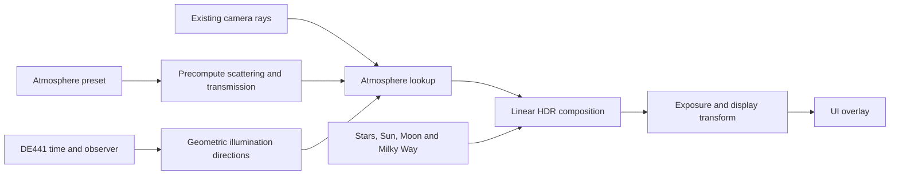

# Dawn and dusk rendering: research and proposed design

Research date: 2026-09-08. Status: proposal; the application renderer has not changed.
Code baseline: `2a03274`.

## Recommendation

Implement a Vulkan atmosphere renderer based on Bruneton's 2017 implementation of
precomputed atmospheric scattering, with spectral integration, ozone absorption,
multiple scattering, and explicit validation through astronomical twilight. Use
Hillaire's 2020 approach as the alternative if interactive atmosphere editing becomes
a priority or the selected implementation exceeds the measured rendering budget.

This is a project-specific recommendation, not a claim that one method is universally
more accurate. Astra normally changes the observing time and direction while retaining
the atmosphere. Precomputing its light transport once avoids rebuilding a sky image
during those interactions. The first implementation milestone must establish twilight
quality and cost before this choice becomes the shipping default.

The desired sequence is continuous: daylight, a reddened low Sun, an illuminated horizon
after sunset, blue twilight, progressively visible stars, and a dark sky. Dawn follows
the same physical model with increasing solar elevation. Identical atmospheric conditions
should not acquire different colours merely because the clock says morning or evening.

## What the application currently does

| Area | Current implementation | Consequence for this work |
| --- | --- | --- |
| Sky colour | [`sky.frag`](../shaders/sky.frag) combines fixed blue/orange colours using solar elevation and an exponential horizon band. | Replace the colour approximation with atmospheric transport. |
| Milky Way | The same shader applies a global twilight fade between solar elevations of approximately -18 and -6 degrees, plus empirical extinction and Moon suppression. | Composite it behind the atmosphere with directional transmittance and consistent exposure. |
| Stars | [`render_scene`](../src/app.cpp) adjusts the magnitude limit by a global daylight factor and applies scalar extinction. | Replace the daylight heuristic and avoid applying extinction twice. |
| Sun/Moon directions | [`RenderScene`](../include/astro/renderer.hpp) receives refracted `Object::observed` directions. | Add unrefracted directions for atmosphere illumination while preserving apparent disc positions. |
| Brightness | Stars are compressed individually; solar and lunar discs use fixed display strengths. | Align their intensity conventions with the new sky before judging visibility. |
| HDR output | [`renderer.cpp`](../src/renderer.cpp) prefers RGBA16F but can fall back to an 8-bit intermediate; [`tonemap.frag`](../shaders/tonemap.frag) applies exponential mapping and a 2.2 gamma approximation. | Specify a consistent linear HDR/display transform and a deliberate capability fallback. |
| GPU plumbing | Two frames in flight, a graphics queue, sampled-image descriptors, and a full 128-byte scene push-constant block. | Atmosphere parameters need a uniform buffer and additional descriptors; precomputation needs its own resources and synchronization. |

## Methods considered

| Method | Evidence and useful properties | Fit for Astra |
| --- | --- | --- |
| Bruneton / Neyret, updated implementation in 2017 | Precomputed multiple scattering; configurable density profiles and ozone; spectral-to-display conversion; CPU reference tests. [Author's implementation](https://ebruneton.github.io/precomputed_atmospheric_scattering/) | Preferred starting point for a stable Earth atmosphere and repeatable time scrubbing. Parameter changes require new precomputation. |
| Hillaire, EGSR 2020 | Small lookup tables and rapid atmosphere updates. Higher scattering orders use an isotropic approximation; the paper discusses resulting errors for strongly anisotropic or dense media. [Paper](https://sebh.github.io/publications/egsr2020.pdf) | Strong option for dynamic weather and lower storage. Deep twilight still needs comparison against a reference; the publication's GPU timings are not M4 Pro measurements. |
| Prague Sky Model, 2021/2022 | Fitted spectral sky with post-sunset features. The published implementation accepts solar elevations only down to -4.2 degrees. [Author's repository](https://github.com/PetrVevoda/pragueskymodel) | Useful early-twilight comparison, but cannot cover the requested transition through -18 degrees by itself. |
| ShowMySky / CalcMySky | A planetarium-oriented scattering model used by Stellarium for advanced atmosphere rendering, with an OpenGL integration and precomputed datasets. [Stellarium guide, section 11.2.2](https://stellarium.org/files/guide.pdf) | Useful comparison for the full visual transition. Direct integration would introduce a second graphics API; use it as a reference rather than an application dependency. |

Port the selected equations and shader functions to GLSL/SPIR-V and Vulkan resource
management. Hardware ray-tracing extensions are not needed for the proposed lookup-table
renderer. Preserve upstream attribution when adapting code: Bruneton's implementation
uses a BSD three-clause licence; Hillaire's sample uses MIT.
[Bruneton licence](https://github.com/ebruneton/precomputed_atmospheric_scattering/blob/master/LICENSE),
[Hillaire licence](https://github.com/sebh/UnrealEngineSkyAtmosphere/blob/master/LICENSE).

## Atmospheric and astronomical inputs

Use a spherical, altitude-dependent clear atmosphere with molecular scattering,
aerosol scattering and absorption, an ozone profile, and a ground albedo. Earth shadow
must participate in the light-transport calculation after the Sun sets. A single-scattering
sunset followed by a hand-painted night gradient is insufficient for the intended result.

Start with the published Earth coefficients and solar spectrum as a reproducible preset.
Treat their density profiles as model assumptions. Pressure/temperature controls currently
drive astronomical refraction; their conversion to a whole atmospheric column must be
explicit, rather than interpreting one surface measurement as a complete weather profile.
The atmosphere represents chosen conditions at the requested date, not reconstructed
weather over the 10,000-year interval.

Reuse DE441 and the existing time/orientation pipeline. Pass geometric topocentric Sun
and Moon directions, observer height, solar distance, and separate apparent disc data
to the renderer. Solar irradiance scales with inverse square distance. Refraction of the
observed discs remains a separate operation; bending of light paths throughout the
atmosphere is a model limitation to evaluate near the horizon, not something corrected
by rotating the entire Sun illumination direction by the observer's refraction angle.

The existing scene accepts heights from -500 m to 100 km. The atmospheric wrapper must
explicitly handle below-sea-level sites without placing the camera inside an opaque
planet, and handle entry/exit rays for observers above the model atmosphere. Keep the
local ENU frame, current projection functions, level-horizon panning, and normal 60-degree
zoom limit. Distinguish the existing flat ground mask/zero-altitude guide from a physical
planetary limb at high altitude; do not silently replace the normal viewing controls.

## Twilight coverage and precision

Civil, nautical, and astronomical twilight boundaries use the **geometric solar centre**
at -6, -12, and -18 degrees. These are labels and event thresholds, not rendering switches.
Sunrise/set uses a disc and refraction convention and must not be confused with centre
crossing zero altitude. [USNO definitions](https://aa.usno.navy.mil/faq/RST_defs)

There is an important configuration trap in the Bruneton demo: its half-precision mode
uses a maximum solar zenith angle of 102 degrees, while its full-precision mode uses
120 degrees. Those correspond to solar elevations of -12 and -30 degrees. Copying the
default half-precision setup would leave part of astronomical twilight outside the
precomputed domain. [Demo configuration](https://ebruneton.github.io/precomputed_atmospheric_scattering/atmosphere/demo/demo.cc.html)

Proposed initial configuration:

- Cover solar elevation down to -30 degrees, including a margin below astronomical twilight.
- Accumulate and initially store scattering tables in FP32. Compare lower-precision storage
  later at night exposure before adopting it.
- Begin spectral integration at 15 wavelengths and compare against 30 or 45 samples.
- Compare 4, 8, and 12 scattering orders; select by convergence in the intended clear/hazy
  presets, rather than assuming four orders suffice at every twilight angle.
- Below the table's solar-angle domain, avoid clamping to a residual glowing twilight.
  Establish where the solar contribution is negligible relative to the night component,
  and use a tested continuous tail if necessary.

The upstream API supports integrating multiple wavelengths into linear sRGB photometric
tables. More precomputed wavelengths increase preparation time, rather than the number
of runtime sky lookups. Its returned three-channel transmittance remains a wavelength
approximation and needs care when applied to coloured astronomical sources.
[Model API and units](https://ebruneton.github.io/precomputed_atmospheric_scattering/atmosphere/model.h.html)

## Render composition and temporal stability

Use the following conceptual composition in one consistent linear HDR scale:

```text
visible sky = solar atmospheric scattering
            + lunar atmospheric scattering
            + local night-sky emission / light pollution
            + atmospheric transmission * extraterrestrial sources
```

Opaque ground and celestial discs require their own occlusion. In particular, a lunar
disc masks the background behind it while foreground atmospheric radiance remains
visible in front of it. The equation is a composition rule, not a claim that the current
Milky Way image or stellar colours are calibrated spectral radiance.



Keep the star PSF and fractional-pixel labels unchanged. Brightness should evolve through
local atmospheric attenuation and contrast against sky luminance. The existing scalar
extinction, global magnitude penalty and Milky Way twilight multiplier must be replaced
together; stacking them on top of physical transmission would over-darken the sky.
Keep a conservative CPU culling limit so a star is not discarded before its GPU visibility
is evaluated. Labels should follow a stable visibility rule without frame-to-frame toggling.

The current fixed Sun/Moon strengths and compressed star fluxes require a documented
mapping to the new HDR scale. Use catalogue magnitudes for relative point-source flux and
the actual angular area for resolved discs. Gaia G, Hipparcos Hp, BSC V and the processed
Milky Way map remain heterogeneous inputs, so this stage does not establish absolute
photometric accuracy. A solar-spectrum atmosphere table scaled for the Moon is likewise
only an approximation to lunar illumination and should be compared separately.

Use manual exposure for reference images. An optional automatic mode should estimate
adaptation from a stable, solid-angle-weighted sky sample, excluding the UI and handling
the solar disc separately. Panning or zooming must not change the exposure simply by
changing screen coverage. Smooth optional adaptation using wall-clock time; define a
deterministic reset on date/location jumps and export the effective exposure. Avoid
white-balancing away the sunset colours. Audit the final display encoding once, retaining
the UI's display-space rendering after tone mapping.

Atmosphere lookups depend on physical directions, never screen-space texture translation.
Time, camera orientation and FOV changes do not invalidate the selected precomputed
atmosphere. Do not introduce temporal jitter, stochastic sampling or history-dependent
denoising into the default sky path. Optional output dithering must remain subtle and
deterministic. Existing solar-system playback updates can drive the lookup every frame.

## Vulkan resources and performance budget

The following is a starting layout using upstream table dimensions, with a separate
single-Mie table to avoid its one-channel reconstruction approximation. Sizes below are
uncompressed texel payloads calculated for Astra, not measured allocations or file sizes.
[Upstream dimensions](https://ebruneton.github.io/precomputed_atmospheric_scattering/atmosphere/constants.h.html)

| Texture | Dimensions | Initial format | Payload |
| --- | --- | --- | ---: |
| Transmission | 256 x 64 | RGBA32F | 0.25 MiB |
| Scattering | 256 x 128 x 32 | RGBA32F | 16 MiB |
| Single Mie | 256 x 128 x 32 | RGBA32F | 16 MiB |
| Irradiance | 64 x 16 | RGBA32F | 0.016 MiB |

One completed set is approximately **32.27 MiB**. Generation needs additional temporary
images; two completed sets may briefly coexist during a preset change. A provisional
256 MiB generation budget and 2 ms incremental steady-state GPU budget are engineering
targets to measure on the M4 Pro, not performance results. Profile at the application's
actual Retina framebuffer size with the existing 16K Milky Way enabled.

Precompute through Vulkan compute passes, with a build-time generator able to produce a
versioned default cache. Load a valid cache at startup; user profile changes produce a
new set in bounded work batches. Hash coefficient data, shader/model version, dimensions,
precision, wavelengths and scattering order in the cache key. Stage a complete set and
publish it only when all passes have finished. Retire old resources after both in-flight
frames have released them. Rapid edits cancel obsolete generations.

Add uniform-buffer and storage-image descriptor capacity. Query compute queue support,
3D texture limits, storage formats and filtering features instead of assuming them from
the existing graphics queue selection. If FP32 linear filtering is unavailable, use an
explicit interpolation path; test packed-dimension boundaries separately. Prefer a common
graphics/compute queue initially. Correct compute-write to subsequent-read barriers and
image-layout transitions are required; retain the current Vulkan baseline by using its
supported synchronization API. [Khronos synchronization examples](https://docs.vulkan.org/guide/latest/synchronization_examples.html)

Keep the shader scene push constants within 128 bytes. Use a separate atmosphere uniform
buffer for radii, coefficients, geometric light directions and photometric scales. Do not
silently render the physical pipeline into the current 8-bit HDR fallback: choose a
validated floating-point path or an explicitly identified simpler rendering mode.

## Interaction and delivery

The first visible milestone should be a selectable physical atmosphere using the current
time, site and display controls, plus reproducible dawn and dusk scenes. Clear/hazy presets
are useful; clouds, terrain and weather acquisition are separate work. A cloudless sunset
can provide horizon colour, blue twilight and an antisolar Earth-shadow transition, but
cannot produce illuminated cloud formations without a cloud model.

After the renderer passes validation, add bilingual twilight phase labels and previous/next
dawn/dusk navigation. Find crossings using the existing ephemeris/time system with bracketing
and refinement, accounting for grazing events at high latitude and the supported date
boundaries. Report absence within the searched interval instead of assuming every date
has a sunrise and sunset. Store atmosphere-model version, preset/parameters, exposure mode
and effective export exposure with scenes; provide a documented migration for old scenes.

Suggested implementation order:

1. Port a fixed Earth atmosphere, generate FP32 tables, and render an isolated twilight
   sweep with manual exposure. Compare the same coefficients against the CPU reference.
2. Integrate transmission, celestial-disc composition, stellar visibility and the existing
   night background. Verify that the Sun, Moon and Milky Way remain coherent.
3. Add caching, preset replacement, optional exposure adaptation, bilingual phase/navigation
   controls, and scene migration.
4. Complete temporal, projection, resource-lifetime and platform-capability regression checks.

## Acceptance and unresolved measurements

| Check | Required evidence |
| --- | --- |
| Twilight range | Fixed-exposure renders at solar elevations +10, +2, 0, -2, -4, -6, -9, -12, -15, -18, -24 and -30 degrees; sample toward, across and opposite the Sun, including 0-5 degree viewing elevation. |
| Reference quality | Compare against the upstream CPU spectral reference with matching coefficients. Use ShowMySky for qualitative cross-checks and Prague only in its supported range; different model assumptions must not be treated as numerical implementation error. |
| Convergence | Record luminance/chromaticity changes as wavelengths, scattering orders and LUT resolution increase. Use an absolute luminance floor when judging relative error near black. |
| Continuous playback | Sweep sunset and dawn at several speeds and in reverse. Under fixed exposure, revisiting the same physical state must reproduce the same result; inspect for banding, steps, flicker and ghosting. |
| Camera stability | Repeat 60-degree zoom-out recovery and low-elevation panning; test all projection modes. Geometric background registration and the level horizon must remain intact. |
| Night compatibility | New/full Moon above and below the horizon, dark/polluted sites, atmosphere disabled, and solar elevations near the LUT boundary; no residual twilight clamp or duplicate extinction. |
| Geography and dates | Equator, Beijing, Atacama, polar day/night and grazing twilight; below-sea-level, mountain and high-altitude inputs; modern dates and both ends of the supported historical interval. |
| GPU lifetime and cost | Vulkan synchronization validation during repeated preset changes, resize, minimize and export; GPU timestamps and memory measurements with 16K background loading accounted for separately. |

This research does not establish a measured speedup, a validated physical accuracy bound,
or a new working renderer. The main open measurements are deep-twilight convergence,
stellar-to-sky brightness calibration, horizon/refraction alignment and the M4 Pro cost
of the selected table format and sampling layout.
